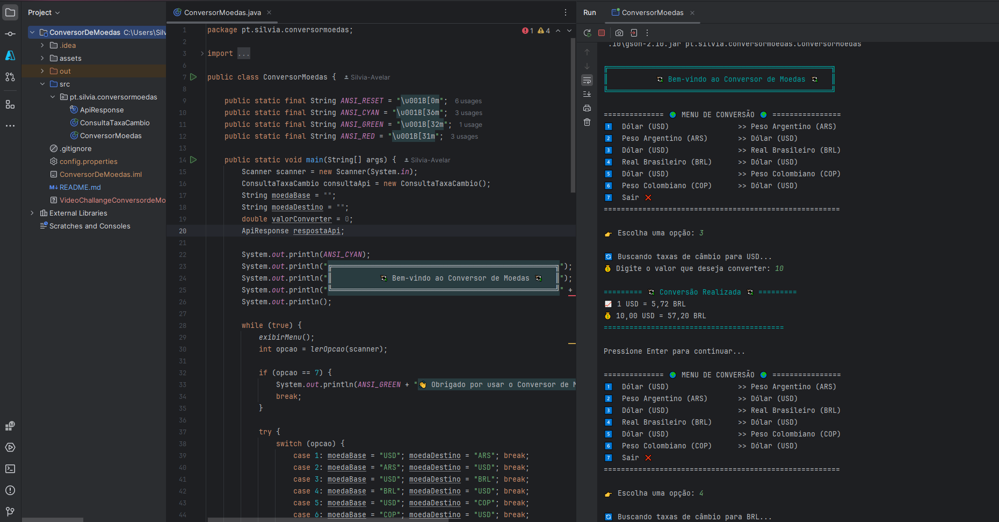

# 💱 Conversor de Moedas - Java 

Bem-vindo ao **Conversor de Moedas** em Java!

[](https://openjdk.java.net/)
[](https://opensource.org/licenses/MIT)
[](https://www.exchangerate-api.com/)

> Aplicativo de terminal que consome a API da [ExchangeRate-API](https://www.exchangerate-api.com/) para conversões monetárias em tempo real com dados do ECB

---

## 🖥️ Demonstração no Terminal

```bash
╔════════════════════════════════════════════════════╗
║           💱 Bem-vindo ao Conversor de Moedas 💱   ║
╚════════════════════════════════════════════════════╝

============== 🌍 MENU DE CONVERSÃO 🌍 ================
1️⃣  Dólar (USD)                >> Peso Argentino (ARS)
2️⃣  Peso Argentino (ARS)       >> Dólar (USD)
3️⃣  Dólar (USD)                >> Real Brasileiro (BRL)
4️⃣  Real Brasileiro (BRL)      >> Dólar (USD)
5️⃣  Dólar (USD)                >> Peso Colombiano (COP)
6️⃣  Peso Colombiano (COP)      >> Dólar (USD)
7️⃣  Sair ❌
=======================================================

👉 Escolha uma opção: 3

🔄 Buscando taxas de câmbio para USD...
💰 Digite o valor que deseja converter: 10

========= 💱 Conversão Realizada 💱 =========
📈 1 USD = 5,72 BRL
💰 10,00 USD = 57,20 BRL
==========================================

Pressione Enter para continuar...
```

## 🛠️ Tecnologias Utilizadas

| Componente          | Detalhes                                                                  |
|---------------------|--------------------------------------------------------------------------|
|  **Java 17** | JDK com novos recursos como sealed classes |
|  | Implementado via `java.net.http` |
|  | Desserialização de JSON |
|  | Formatação de texto colorido |


## 🎯 Funcionalidades
| Feature               | Descrição                                  |
|-----------------------|--------------------------------------------|
| 🌍 Multi-moedas       | Suporte a 160+ moedas via API              |
| ⚡ Tempo real         | Taxas atualizadas hourly                  |
| 🛡️ Validação         | Checagem de entradas inválidas            |
| 📊 Logs               | Registro de operações em arquivo           |


## ✅ Pré-requisitos

|  |  |
|-------------------------------|---------------------------------------------------------------------|
|  | JDK instalado (verifique com `java -version`) |
|  | Conexão estável para chamadas API |
|  | Obtenha em [ExchangeRate-API](https://www.exchangerate-api.com/) |


## 🖼️ Demonstração Visual

| Preview da Interface | Logo do Projeto |
|----------------------|-----------------|
|  |  |
*Interface do terminal e identidade visual do projeto*


## 🧑‍💻 Autor
<p align="center">

</p>
<p align="center">
Desenvolvido com 💙 por <strong>Sílvia Avelar</strong>
</p>
<p align="center">
<a href="https://www.linkedin.com/in/silvia-avelar/" target="_blank">

</a>
&nbsp;&nbsp;
<a href="https://silviaavelar.github.io/Portfolio/" target="_blank">

</a>
</p>
<p align="center">
Entre em contato ou veja outros projetos!
</p>